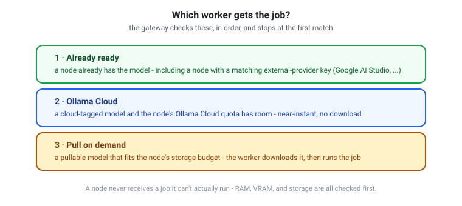
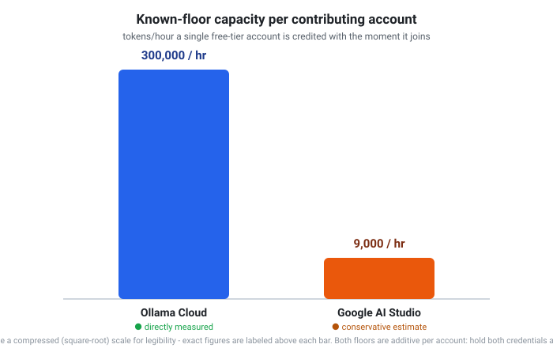
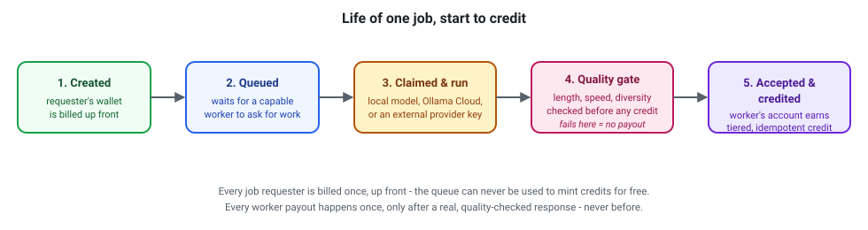

# The compute network

TokenBroker doesn't rely on a single data center. It routes work to a network
of **compute nodes** — desktop PCs contributed by members like you — plus
cloud-hosted models. This section explains how the network works, how to join
it, and how you get paid for participating.

## Why a network?

Some models are small enough to run on a laptop. Others need serious GPUs. A
network lets the service offer both: a node with an RTX-class GPU can serve
bigger local models, a modest node can serve smaller ones, and everything can
fall back to cloud models when no node is available.

The more nodes join, the more capacity the network has — which keeps the
service available around the clock and reduces reliance on any single piece
of hardware.

## How nodes are chosen

Every request is matched to the **best available node** for that model:

1. A node that already has the model pulled and meets its requirements —
   fastest path.
2. A node with enough disk space to pull the model on demand.
3. A cloud-hosted model (e.g. Ollama Cloud) when the request is for a cloud
   model or no capable local node is online.

Nodes only ever receive work they can actually do — the gateway checks GPU
VRAM, system RAM, and storage before assigning anything. A node never gets a
job for a model it can't handle.

## Joining the network with the worker

The **TokenBroker Worker** is a small Windows application you download from
your dashboard. Highlights:

- **Easy install** — download the bundle, double-click, done. No command line.
- **Easy uninstall** — a single uninstaller removes everything.
- **Visible, not hidden** — it lives in the taskbar tray with a live status
  window showing uptime, requests per minute, CPU/GPU use, and what it's
  working on. It can minimize to the tray and run 24/7.
- **Transparent** — you see redacted prompts, compute cost, payment for each
  completed job, and timestamps.
- **Private by design** — the worker shows a **redacted** view of the prompt
  and never displays the requester's identity. It cannot see who you are
  serving.

The worker connects outbound only — **no ports are opened** on your router.

### What the worker needs

- Windows 10/11, 64-bit.
- Ollama installed (the worker uses it as the local inference engine).
- A GPU is a big advantage (more model families, bigger jobs), but not
  strictly required — smaller models run on CPU.
- Storage you're willing to contribute. Models the worker pulls for the
  network are evicted automatically after 2 hours idle, so storage stays
  available for your own use.

### Optional: connect your Ollama Cloud account

If you sign in to your free Ollama account in the worker, the node can take on
**cloud-hosted models** too — including large models your hardware could never
run. The worker tracks your cloud usage and reports how much remains, and it
stops accepting cloud work the moment your free quota is exhausted (it
resumes when the quota resets).

### Optional: bring your own cloud API key

You don't need a GPU, or even Ollama, to contribute real capacity. If you hold
a free-tier API key from a supported external provider — **Google AI
Studio** today — you can add it to your account on the Compute page, and
every worker on that account (desktop or mobile) can serve jobs for that
provider's models directly, calling the provider's own API with your key.
This is a completely separate quota pool from Ollama Cloud, so an account
with both contributes more capacity than either alone.

A brand-new worker is credited with a conservative baseline the moment it
joins, rather than counting as zero capacity until it has a track record.
Ollama's baseline came from a real, deliberately bounded measurement (a
controlled one-hour test run to completion with zero rate-limit errors);
Google doesn't publish a fixed limit at all, so that figure is a careful,
conservative estimate instead — the [live network status
page](https://tokenbroker.hopto.org/network) always favors real measured
throughput over either baseline once a worker has one.

## Mobile workers (Android & iOS)

The network isn't limited to desktops. A companion mobile app runs the same
relay loop in the background — heartbeat, claim a job, run it, report back —
using a foreground service so it keeps working with the screen off. A phone
can't run large local models, so it serves cloud-hosted and external-provider
work (Ollama Cloud, or a provider key you've added to your account) rather
than pulling models locally. Pairing a phone to your account takes a one-time
code generated from the dashboard.

## How workers earn credits

Every completed, accepted job pays **credits** into your account. Quality
matters:

- The network grades completed work (response length, speed, variety,
  consistency).
- **Premium, standard, and basic** credit tiers exist. Well-behaved,
  well-performing nodes earn more valuable credits; low-quality nodes earn
  less valuable ones.
- Credits can be redeemed for API usage. They are **not** cash — 1 credit is
  not 1 cent. Their value depends on the quality tier and current network
  conditions.

### Anti-exploit protections

The network is built to resist gaming:

- **Minimum contribution** before inference is accepted (tiny jobs are
  rejected).
- **Duration and speed gates** — instant/fabricated completions are caught.
- **Diversity checks** — canned or repeated responses are flagged.
- **One worker per account**, bound to a hardware fingerprint and the IP it
  registered from.
- **VM detection** — virtualized workers are rejected.
- **Cloud quota honesty** — a node that exhausts its cloud quota stops
  advertising cloud models until it resets.

These protections exist so that real users get real work done, and credits
mean something.

## Private (encrypted) jobs

Requests that need extra privacy can be submitted as **private jobs**: the hub
encodes the prompt into an encrypted glyph, only **trusted workers that have
private jobs enabled** receive it, and the worker decodes it in memory,
computes, and returns the answer as an encrypted glyph. The worker never
writes the prompt to disk and never displays it.

If you run a worker, you control this with the **Priv on / Priv off** button
in the worker window (or the tray menu). Private jobs are on by default; turn
them off and your node will only ever receive public work.

## Live network status

Anyone — signed in or not — can see the network's real-time aggregate
capacity, how many independent accounts are contributing, and recent job
activity at **[/network](https://tokenbroker.hopto.org/network)**. The page
also explains exactly how the numbers are calculated, including the honest
caveats: some figures are directly measured, others are conservative
estimates for a provider that doesn't publish its own limits. It never shows
per-node or per-person detail — only network-wide totals.

## Worker dashboard

Your dashboard's **Compute** page shows:

- Your node's status, hardware fingerprint (never how it's derived), and
  quality score.
- Expected performance based on the RAM, CPU, and GPU detected.
- A collapsible transaction history of every job and its earnings.
- Rejected worker attempts (and why) for full transparency.
- The worker download, the Ollama install link, and instructions.

## Removing the worker

Uninstall is one double-click. The worker leaves no background services, and
your account keeps whatever credits you've earned.

## Pay-gated (subscription) models

Some Ollama cloud models require a paid ollama.com account (Pro/Max) or
purchased "extra usage" - a free account gets `402 Payment Required` when it
tries to run them. The network handles this in three layers:

1. **Is the worker paying?** Each worker probes a known pay-gated model
   (`cloud_probe_model`, default `deepseek-v4-flash:0731`) at boot and reports
   `free` / `paying` / `unknown` in its heartbeat (`cloud.subscription`), so
   admins can see which nodes are paid.
2. **Does a model need a paying worker?** The hub records every 402 as a
   per-node `paywalled` marker (`compute_model_access`). A node that hit 402 on
   a model stops advertising and claiming it.
3. **Can any worker serve it right now?** Before a user or gateway-fallback
   job is queued, the hub checks `canAnyNodeServe()`: some online node must
   have the model, be cloud-capable and not paywalled for it, or be able to
   pull it. If none can, the request fails fast with
   `503 compute_unavailable` ("may require an Ollama subscription worker")
   instead of queuing a job that will burn the fallback timeout and fail.
