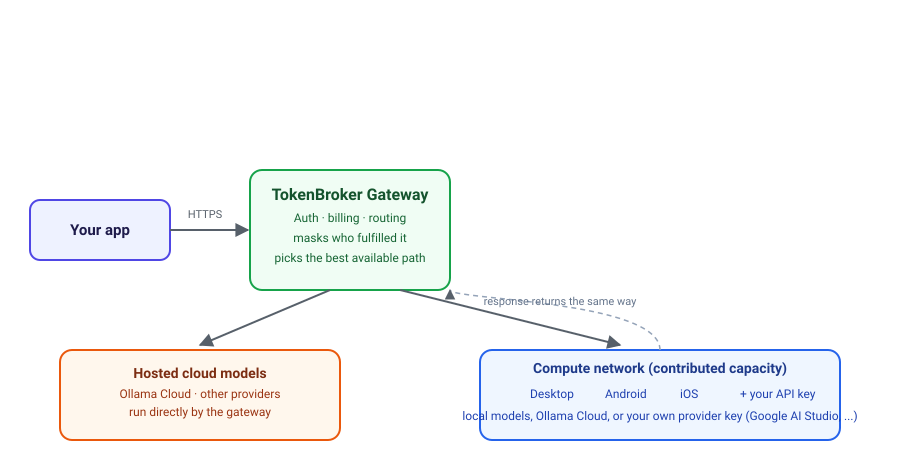

# Overview

## What problem does TokenBroker solve?

Open-weights models are incredible — but running them well is not for
everyone. Big models need big GPUs. Small machines can only run small models.
And the hosted APIs that solve this are fragmented: a different account, a
different key, a different pricing scheme for every provider.

TokenBroker solves this with one unified service:

1. **A catalog** of hundreds of models, from lightweight 0.5B models that run
   on a laptop to 600B+ reasoning models that only exist in the cloud.
2. **A single API** — OpenAI-compatible, so it works with the tools you
   already use (LangChain, Open WebUI, custom code, scripts).
3. **A compute network** — contributors run a small worker on their own
   hardware and earn credits. This keeps the network growing and the prices
   honest, without the overhead of a giant data center.

## How a request flows

Every request lands on the gateway first. The gateway decides, per request,
whether to answer it directly with a hosted cloud model or hand it to the
compute network — and if the compute network, which of the many contributed
workers is the right one. The response always travels back through the
gateway the same way; you never see or need to know which machine (or whose)
actually answered.

The public entry point is [https://tokenbroker.hopto.org](https://tokenbroker.hopto.org),
which is delivered through Cloudflare's edge network. That means:

- **No port forwarding** — the operator's home network never exposes a port.
- **No IP guessing** — the domain is stable, even as the underlying tunnels
  rotate.
- **Fast, cached, protected** — Cloudflare sits in front of every request.

## The three parts of the system

### 1. The website & dashboard

Sign up with email/password or Google, verify your email, and land in a
dashboard where you can:

- Browse the model catalog with live pricing and descriptions.
- Create and manage API keys.
- Try models in the playground.
- Top up your wallet, buy a plan, or pay with a static Square link.
- Manage your worker node and watch its earnings and quality score.
- View usage, billing history, and request transcripts.

### 2. The API

A single, OpenAI-compatible endpoint accepts `chat/completions`,
`completions`, and `embeddings` requests. Authentication is a simple API key.
Billing is token-based, with predictable per-model pricing and daily caps you
can set per key. See the [API reference](api-reference.md).

### 3. The compute network

Instead of building one giant GPU farm, TokenBroker routes work to a network
of volunteer nodes — the **compute network**:

- Nodes run a small, transparent desktop worker (Windows; taskbar/tray app).
- The worker advertises what it can run: its GPU, RAM, storage, and models.
- The gateway matches each request to the best available node — a node that
  already has the model, then a node with room to pull it, then a cloud
  fallback.
- Nodes earn **credits** for completed work. Credit quality depends on node
  quality (see [Pricing & credits](pricing-and-credits.md)).

This is what keeps TokenBroker sustainable: the more people contribute, the
more capacity exists, and the cheaper access becomes for everyone.

## What TokenBroker is not

- It is **not** a training platform.
- It is **not** an anonymous darknet — accounts are real, payments are real,
  and abuse controls exist.
- It is **not** a code repository. This repository documents the service;
  the implementation stays private for security reasons.

## Where to go next

Ready to try it? **[Getting started](getting-started.md)**.
Curious about the network? **[Compute network](compute-network.md)**.
Want every detail in one place? **[A full breakdown of the system](system-breakdown.md)**.
Want the real numbers, not marketing copy? **[Tested & verified](tested-and-verified.md)**.
Want to know why any of this exists? **[Take back your compute](take-back-your-compute.md)**.
