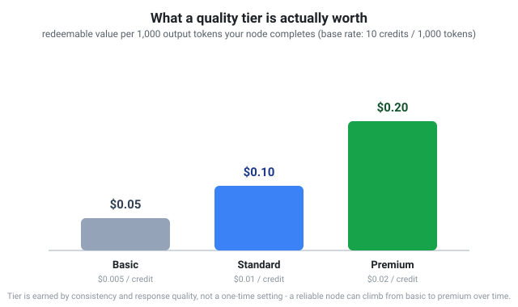

# Pricing & credits

TokenBroker runs on two currencies moving in opposite directions: real money
flowing in from people who spend, and credits flowing out to people who
contribute. Both are designed to be predictable and boring in the best
sense — no surprise line items, no mystery about what a credit is worth, no
fine print about how a redemption actually settles. This page is the exact
mechanics of both.

## How you pay

TokenBroker charges **per token**, with per-model input and output prices.
Every model in the catalog shows its own price before you use it — there are
no surprise line items.

Payments are processed through **Square**, so you can pay with:

- Credit/debit cards.
- Cash App.
- Static payment links shared from the dashboard.

Two ways to use the service:

1. **Pay as you go** — keep a balance in your wallet; every request deducts
   from it. Holds are placed and released per request, so you're never
   double-charged.
2. **Plans** — a subscription that includes monthly usage and predictable
   limits. Plans also unlock higher rate limits for active users.

Per-key **daily spend caps** let you (or your team) set hard ceilings so a
runaway script can never drain your wallet.

## Why "credits" are not cents

The compute network pays contributors in **credits**. A common misconception
is that one credit equals one cent — it doesn't.

Credits are the network's internal currency. Their value depends on:

- **Quality tier** — premium, standard, or basic.
- **Network conditions** — supply of nodes vs. demand for work.
- **Redemption rules** — credits redeem for API usage, not cash.

You can earn credits by contributing compute, and you can spend them on API
usage. Think of it like airline miles earned from a good trip — valuable,
redeemable, but not a bank balance.

## Credit quality tiers

The network grades nodes on response quality, consistency, and reliability.
The base earning rate is **10 credits per 1,000 real output tokens** your
node completes; what a credit is actually worth depends on your tier:

| Tier | Who gets it | Value per credit | Per 1,000 output tokens |
| --- | --- | --- | --- |
| Premium | Well-performing, consistent nodes | $0.02 | $0.20 |
| Standard | Normal, reliable nodes | $0.01 | $0.10 |
| Basic | Lower-quality or inconsistent nodes | $0.005 | $0.05 |

Tier isn't a one-time label — it's derived from your node's ongoing accepted-
vs-failed ratio, latency, and gaming-penalty history, so a node that keeps
producing quality responses climbs tiers over time. The dashboard shows your
current tier and quality score so you always know where you stand and what
it would take to move up.

## Fairness & abuse controls

To keep credits meaningful:

- Tiny, trivial, or fabricated jobs earn nothing.
- Extremely long, redundant jobs that do no real work are rejected.
- Duplicate/canned responses are flagged.
- Each account gets **one worker**, bound to a hardware fingerprint.

Real work, real credits. The system is designed to reward nodes that serve
real members and paying customers first.

## Referrals: $5 for you, $5 for them

Every account has a personal referral code (find it on your dashboard). When
someone signs up using it and proves they're a real, active user — either by
registering a worker node or by completing a real payment, whichever happens
first — **both of you get $5.00 credited to your wallet**, once, no strings
attached beyond that. There's no cap on how many people you can refer, and
the reward is idempotent on the backend, so it's paid exactly once per
referred account no matter what triggers it.

This exists for the same reason the rest of the network does: every genuinely
new, independent member — someone who wasn't going to sign up anyway —
makes the network stronger for everyone already in it, not just for the
person who referred them.

## Refunds & disputes

Wallet credits are refundable at the operator's discretion per the terms of
service. Contact the operator through the dashboard for any billing issue.

## Ads

The website is ad-supported (Google AdSense and similar providers) to keep
entry costs low. Ads never appear inside API responses — only on the site
itself.

## Related reading

- [Tested & verified](tested-and-verified.md) — the real quality-gate
  thresholds credits are checked against.
- [Compute network](compute-network.md) — how to start earning.
- [FAQ](faq.md#payments) — quick answers on billing and refunds.
