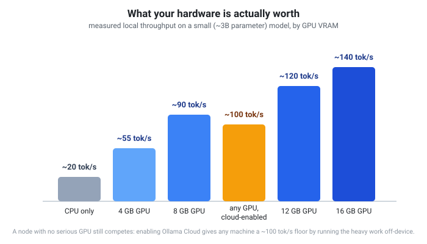

# Tested & verified

Most of what's on this site is a description of intended behavior. This page
is different: it's a running log of things the team actually measured,
broke, or discovered by testing the real system against the real internet —
including the times it didn't work the first time.

## Real throughput, not a guess

TokenBroker's Ollama Cloud capacity baseline (see [capacity
comparison](compute-network.md#optional-bring-your-own-cloud-api-key)) is
not a number from a spec sheet. It came from a deliberately bounded, one-hour
probe run against a real free-tier account: 664 real requests, zero
rate-limit or quota errors, 367,728 real tokens generated. The published
baseline (300,000 tokens/hour) is that result rounded *down* for a safety
margin, not rounded up for a better-looking number.

Google AI Studio doesn't offer the same option — as of this writing Google
publishes no fixed rate-limit table for it at all (their own docs point you
to a per-account dashboard instead), and the API returns no rate-limit
headers to infer one from. So that baseline is explicitly labeled as an
estimate, not a measurement, until a Google-side probe like the Ollama one
exists. We'd rather tell you which numbers are which than round both to look
equally authoritative.

## What actually breaks a job, tested live

The network's anti-farming quality gate isn't theoretical — here's a real
example from testing the Google AI Studio integration:

> A test job deliberately asked a worker for the shortest possible answer,
> on purpose, just to verify the whole path worked end to end. The worker
> claimed it, called Google's real API, and got back exactly the trivial
> answer it asked for. The job was still marked **failed** — the response
> was real, but too short to count as genuine work.

That's not a bug report — it's the gate working exactly as designed. A
follow-up job with a normal, realistic prompt went through cleanly in a few
seconds on the same worker. We don't publish the exact thresholds those
gates check (length, timing, throughput, and response diversity, among
others) — the same reason a bank doesn't publish its exact fraud-detection
rules. What we can tell you honestly: they're tuned against real completions
from real hardware, not guessed at, and they're revisited whenever testing
turns up a gap.

## Known, tested request limits (so you don't have to guess)

We deliberately pushed on the edges of the system — large prompts, batches of
large jobs, oversized payloads — to find real limits rather than assume
ones. These are consumer-facing request limits (the kind any API documents
so you can build reliably against it), not the anti-abuse detection logic
above:

| Limit | Value | What happens past it |
| --- | --- | --- |
| Job payload size | 100,000 characters (raw request JSON) | `400 payload_too_large` |
| Output tokens per job | 4,096 | Requests get capped, not rejected |

These aren't arbitrary — they came out of intentionally sending oversized
and bulk requests during development and watching what needed a real limit
versus what the system already handled gracefully.

## A real bug we found and fixed

Early in mobile support, the Android worker's cloud requests were getting a
bare `403 Forbidden` from Ollama's cloud API — with the exact same key,
headers, and body that worked perfectly from every other client. The cause
turned out to be TLS fingerprinting: Android's default HTTP client has a
distinctive low-level handshake signature that anti-bot systems can
recognize as non-browser scripted traffic and block *before* any
credential check even happens — completely independent of whether the
request itself was correct. Switching the mobile client to a networking
library with a standard, unflagged TLS signature (the same kind any real
mobile app uses) fixed it immediately.

We're including this because it's a good example of the gap between "the
code looks right" and "the code works against the real internet" — and why
this page exists instead of just a features list.

## What we found *doesn't* work (yet)

Not every integration attempt succeeds, and we'd rather say so than quietly
drop it:

- **Structured outputs / JSON mode on Ollama Cloud**: as of this writing,
  Ollama's cloud backend does not support structured/JSON-schema-constrained
  outputs, confirmed directly against their own documentation. If your
  workflow depends on guaranteed JSON shape, prompt for it explicitly and
  validate on your side rather than relying on a `response_format` parameter
  against a cloud model.
- **Stale model names**: providers retire model versions without much
  warning. Before adding Google's Gemini model to the catalog we caught two
  already-retired names (`gemini-2.0-flash`, `gemini-1.5-flash`) by testing
  live against the real API rather than trusting a reference table — the
  live model that replaced them is the one actually in the catalog today.

## What's worth taking away from this

None of this is meant as a warning label — it's meant as evidence that the
numbers elsewhere on this site (capacity baselines, quality gates, model
names) are grounded in something more than a marketing deck. When we don't
know something for certain — like Google's real rate limit — we say so
instead of inventing a confident-sounding number.

See the [full system breakdown](system-breakdown.md) for how these pieces
fit together, or the [FAQ](faq.md) for quick answers.
